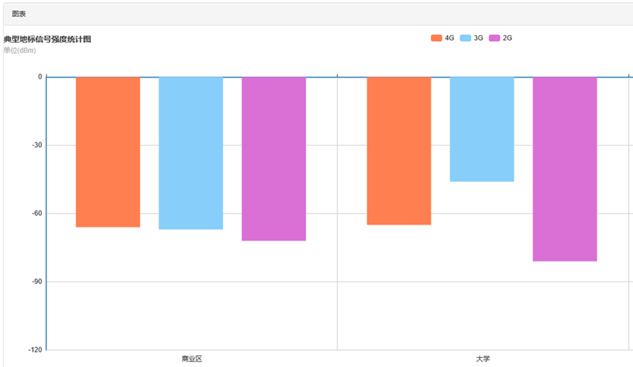
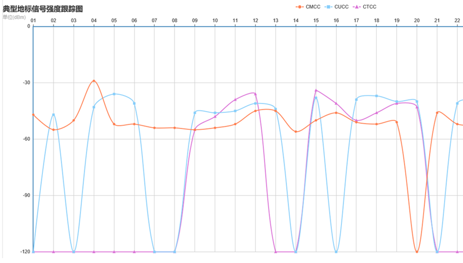
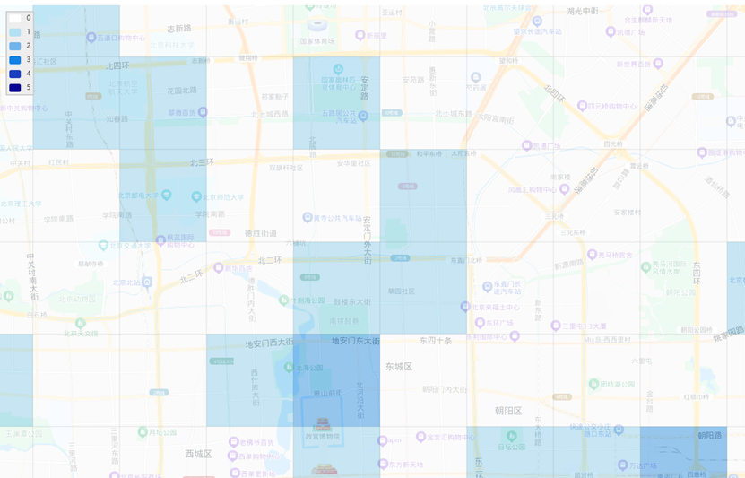
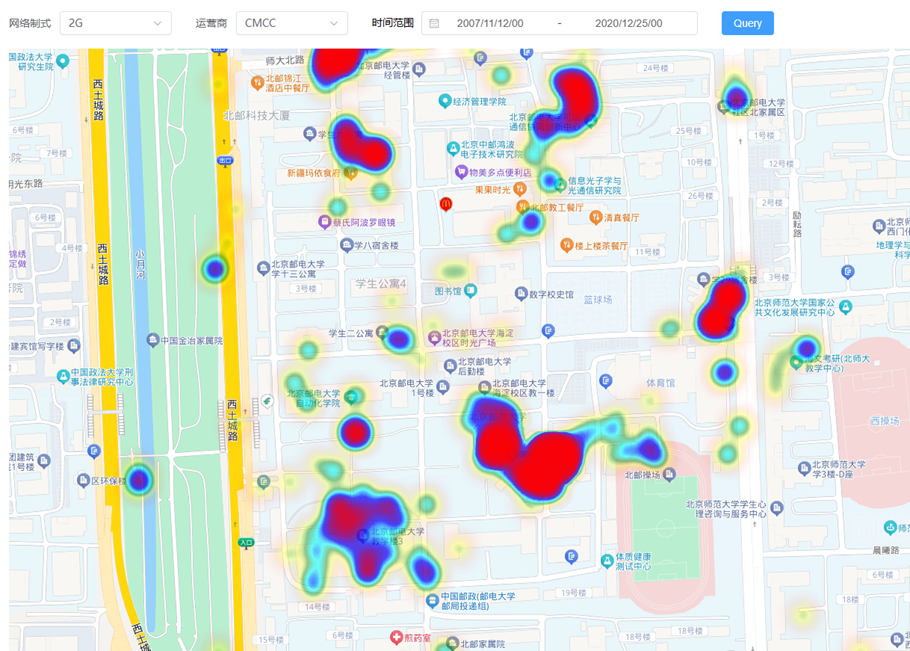

# 电信大数据分析平台

基于运营商手机测速数据的多维度分析平台，结合Hadoop生态与微服务架构，实现信号覆盖质量评估、用户行为分析和网络优化决策支持。前后端分离设计，提供实时查询与动态可视化能力。


<!-- **演示地址**：[]() | **接口文档**：[Swagger UI]() -->

---

## 技术全景


### 🛠️ 核心架构


### 后端技术栈

| 模块          | 技术选型                                                                 | 特性说明                     |
|---------------|--------------------------------------------------------------------------|------------------------------|
| 数据存储      | HBase 2.0 + Phoenix 5.0                                                  | 列式存储+二级索引优化         |
| 计算引擎      | Hive 3.1                                                                 | 离线TB级数据处理              |
| 服务框架      | Spring Boot 2.7 + MyBatis                                                | 声明式事务控制                |
| 接口管理      | Swagger 3.0                                                              | RESTful API文档自动化         |
| 数据模型      | Lombok + DTO分层                                                         | 精简POJO类代码量              |

### 前端技术栈
| 模块          | 技术选型                                                                 | 特性说明                     |
|---------------|--------------------------------------------------------------------------|------------------------------|
| 框架          | Vue3 + JavaScript                                                        | 组合式API           |
| UI组件库      | Element Plus                                                             | 表单/表格/弹窗组件化         |
| 可视化        | ECharts 5.6 + 百度地图JavaScript API                                     | 热力图/轨迹动画支持           |
| 工程化        | Vite 4.0                                                                 | 秒级HMR热更新                |

---

## 系统模块

### 后端服务架构（大致）
```
TelecommunicationsBigData-BackEnd
├── config/                  # 配置类
│   ├── CorsConfig.java      # CORS配置
│   └── SwaggerConfig.java   # Swagger配置
│
├── controller/              # 控制器类
│   ├── ConnectPointController.java
│   ├── DataLinksController.java
│   └── PopularMobileController.java
│
├── dao/                     # 数据访问对象
│   ├── ConnectPointMapper.java
│   ├── DataLinksMapper.java
│   └── PopularMobileMapper.java
│
├── model/                   # 数据模型
│   ├── dto/                  # 数据传输对象
│   ├── entity/               # 实体类
│   └── vo/                   # 视图对象
│
├── result/                  # 结果类
│   └── Result.java
│
└── service/                 # 服务接口
    ├── ConnectPointService.java
    ├── DataLinksService.java
    ├── PopularMobileService.java
    └── impl/                # 服务实现类
        ├── ConnectPointServiceImpl.java
        ├── DataLinksServiceImpl.java
        └── PopularMobileServiceImpl.java
└── resources/
    ├── application.yml              # Spring Boot配置文件
    └── mapper              # MyBatis映射

```


### 前端模块设计 (大致)

```
telecommunicationsbigdata-frontend/
├── src/                     # 源代码
│   ├── api/                 # API 接口
│   ├── components/          # 共享组件
│   ├── router/              # 路由配置
│   ├── utils/               # 工具函数
│   ├── views/               # 视图组件
│   ├── App.vue              # 主应用组件
│   └── main.js              # 入口文件
├── index.html               # HTML 模板
├── package.json             # 项目配置
```


---

## 核心特性
### 🌐 核心功能模块
#### 1. 地理空间分析
- **信号热力图**：基于百度地图API渲染信号强度分布，支持多运营商对比
- **地标追踪**：对商业区/居民区等不同分类的历史信号质量进行时空趋势分析
- **基站覆盖**：可视化基站经纬度与用户位置的关联关系

#### 2. 网络质量评估
- **多维度指标**：时延、上下行速率
- **动态排名**：按省份/城市/地标生成网络质量TopN榜单


#### 3. 用户行为分析
- **终端画像**：手机品牌/版本与网络质量的关联分析
- **APP流量监控**：根据流量分析应用使用的区域分布特征

### 部分核心效果展示







### ⚡ 性能优化
- **Phoenix索引**：针对高频查询字段（如`operator_name`, `network_type`）建立覆盖索引
- **列式存储**：HBase的CF设计将频繁访问的字段（经纬度、时间戳）独立存储
- **批量写入**：使用Phoenix的`UPSERT SELECT`语法实现TB级历史数据高效迁移
- **缓存策略**：Vue前端对地图瓦片数据和排行榜结果进行LocalStorage缓存


## 部署需求

- Hadoop集群（3节点起配，12GB内存/节点，配置HDFS+YARN）
- HBase 2.0+ & Apache Hive 3.0+ & Phoenix 5.0+
- JDK 11+ / Node.js 16+

### 使用方法

#### 1. 数据导入
- 将历史数据上传到HDFS。
- 使用Hive创建数据库和表，加载数据到Hive表中。

#### 2. 数据处理
- 编写SQL语句，从Hive表中抽取所需字段。
- 使用Phoenix创建结果表，并将处理后的数据加载到Phoenix表中。

#### 3. 数据展示
- 启动Spring Boot后端服务，提供数据查询接口。
- 启动Vue.js前端项目，访问Web页面，查看数据可视化结果。

---

## 许可协议
本项目基于 [MIT License](LICENSE) 开源，欢迎二次开发和技术交流。数据可视化部分需遵守[百度地图API使用条款](https://lbsyun.baidu.com/index.php?title=open/license)。

